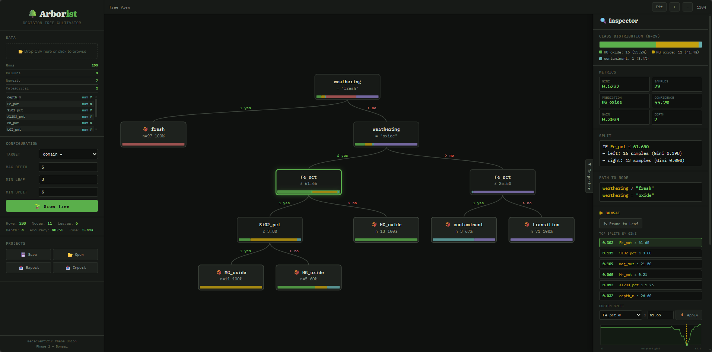

# 🌳 Arborist

**Decision Tree Cultivator** — Build, reshape, and export CART decision trees for classification and regression.

Arborist is a browser-based interactive tool for building decision trees with a unique **bonsai workflow** — grow a tree from data, then reshape it manually with domain knowledge. Designed for geoscientists, geometallurgists, and anyone who needs transparent, auditable classification and regression rules.

**Single HTML file. Zero dependencies. Works offline.**

## Quick Start

1. Download `arborist.html`
2. Open it in any modern browser
3. Load a CSV or use an example dataset
4. Click 🌱 Grow Tree

That's it. No install, no server, no build step, no internet required.

## Screenshot

## Features

### CART Algorithm
- Full implementation of Breiman et al. (1984) — Classification and Regression Trees
- **Classification** using Gini impurity with exhaustive threshold search
- **Regression** using variance reduction (MSE) with R² metric
- Auto-detection of mode from target column type
- Configurable max depth, min leaf size, and min split size

### Bonsai Workflow
The core differentiator. After growing a data-driven tree, reshape it interactively:

- **✂ Prune to Leaf** — collapse a subtree, simplifying the model
- **🌿 Regrow from Leaf** — let CART find the best split for a leaf
- **⚡ Force Split** — manually split on any feature at any threshold, with an interactive impurity chart for visual threshold selection
- **Top Splits** — view the 6 best data-driven splits ranked by gain; click to apply
- **Undo stack** (30 levels) and full reset to original tree
- Real-time accuracy/R² feedback after every edit

### Inspector Panel
Click any node to see:
- Class distribution bar chart (classification) or value histogram (regression)
- Gini impurity / variance, sample count, prediction, confidence
- Split details with child statistics and gain
- Bonsai action buttons contextual to node type

### Column Type Overrides
Click column type badges (`num #` / `cat ●`) to toggle numeric ↔ categorical — essential for coded variables like lithology codes, zone IDs, or drillhole numbers that parse as numeric but should split categorically.

### Export Formats
- **📋 Rules** — human-readable IF/AND/THEN pseudocode (for reports and documentation)
- **🐍 Python** — nested `if/else` function, paste into any script
- **📊 Excel IF()** — nested `=IF()` formula for spreadsheets
- **🗄 SQL CASE WHEN** — for block model software (Vulcan, Surpac, Datamine, Deswik)
- **📁 CSV** — full dataset with predictions, confidence, and leaf IDs appended

All exports are regression-aware (numeric predictions with σ for regression, class labels with % for classification).

### SQL Import
Paste a `CASE WHEN` block from Minitab, legacy block models, or any SQL source. Arborist parses the conditions and reconstructs a binary tree. If data is loaded, accuracy is computed instantly — then reshape with bonsai tools and re-export the improved version.

### Projects
- **Save/Load** to browser IndexedDB (no size limit)
- **Export/Import** as JSON files for sharing between machines
- Projects store: CSV data, tree structure, config, column type overrides, and tree mode

### Guided Workshop
An interactive 18-step tutorial accessible from the splash screen or toolbar. Each step has action buttons that drive the real UI — loads data, selects nodes, applies operations. Covers CART theory, Gini impurity mathematics, variance reduction, and the full bonsai workflow with geological context.

## Use Cases

**Geometallurgical domaining** — define processing domains (oxide/transition/fresh, ore types, metallurgical zones) from geochemical data, with expert control over boundary placement.

**Resource estimation domains** — build estimation domains where each leaf defines a stationary zone for variogram modeling and kriging.

**Ore/waste classification** — generate auditable rules for grade control that can be exported as SQL directly into block model software.

**Legacy model auditing** — import existing domain rules (SQL), evaluate against new data, refine with bonsai tools, and re-export updated rules.

**Regulatory documentation** — the transparent IF/THEN rule format produces domain definitions that are straightforward to document in JORC Table 1 (Section 3) or NI 43-101 technical reports, where Competent Persons / Qualified Persons must justify estimation domain boundaries.

## Technical Details

- **Language:** Vanilla JavaScript, inline CSS, single HTML file
- **Rendering:** Pure HTML/CSS nodes with flexbox layout (no canvas, no SVG for tree)
- **Storage:** IndexedDB for projects, no localStorage (handles large datasets)
- **Algorithm complexity:** O(n · m · log n) per tree level, where n = samples, m = features
- **Tree serialization:** Strips row arrays, replays splits from root to reconstruct on load
- **Tested on:** Chrome, Firefox, Safari, Edge (any browser with ES2020+ support)

## References

Breiman, L., Friedman, J.H., Olshen, R.A. and Stone, C.J. (1984). *Classification and Regression Trees*. Wadsworth & Brooks/Cole, Monterey, CA. ISBN 978-0-412-04841-8.

Pedregosa, F. et al. (2011). Scikit-learn: Machine Learning in Python. *Journal of Machine Learning Research*, 12, pp. 2825–2830.

The CART implementation follows Breiman et al. (1984). The incremental sweep for optimal numeric thresholds is inspired by scikit-learn's `DecisionTreeClassifier`. No code was used from either source — Arborist is a clean-room implementation in vanilla JavaScript.

## GCU Classification

**WA** — Works in an Airplane. Fully offline, single HTML file, zero network calls. Deployable on air-gapped mine site laptops, field camp tablets, or opened from a USB stick.

## License

MIT © 2026 Arthur Endlein

## Author

Arthur Endlein ([@endarthur](https://github.com/endarthur))

Geoscientific Chaos Union
