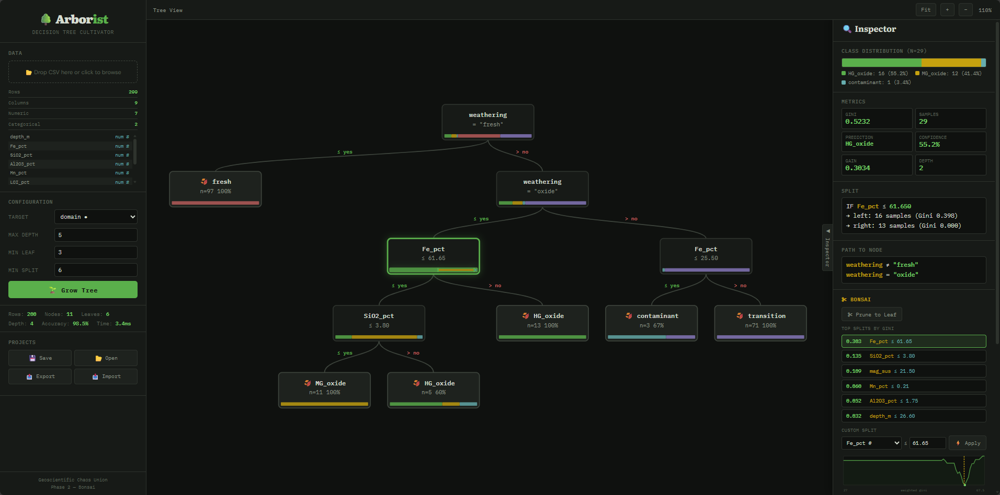

# 🌳 Arborist

**Decision Tree Cultivator** — Build, reshape, and validate CART decision trees for classification and regression, in the browser.

[](LICENSE)
[](#gcu-classification)

Arborist is a browser-based interactive tool for building decision trees with a unique **bonsai workflow** — grow a tree from data, then reshape it manually with domain knowledge. Designed for geoscientists, geometallurgists, and anyone who needs transparent, auditable classification and regression rules — with live holdout validation that keeps you honest about what your edits actually do to the model.

**Single HTML file. Works offline. USB-stickable.**

## Quick Start

**[Open Arborist →](https://endarthur.github.io/arborist/)**

Or run it locally:

1. Download `index.html`
2. Open it in any modern browser
3. Load a CSV (or pick an example dataset from **File → Load …**)
4. Click 🌱 **Grow Tree**

That's it. No install, no server, no internet required.

## Screenshot



## What's new in v2

- **Live holdout validation** with stratified, drillhole-grouped, and spatial partition strategies. Train-vs-test scores update on every bonsai edit (the reviewer-response feature).
- **Spatial exclusion buffer** — when XYZ columns are assigned, the validation panel splits the test set into "leaky" (within the buffer of any training sample) and "isolated" (beyond it). The Δ between leaky and isolated accuracy is the autocorrelation-leakage diagnostic.
- **Feature importance panel** — bar chart of weighted Gini decrease per feature.
- **3D scatter panel** — point cloud of samples in space, coloured by predicted / true / misclassification, via [@gcu/dee](https://www.npmjs.com/package/@gcu/dee).
- **Dockview-based panel layout** — every panel is dockable, splittable, tabbable, and floatable. Long-form dialogs (SQL import, Leapfrog export, Help) open as floating panels so they don't block the tree.
- **Column roles** — Target / X / Y / Z / Drillhole ID assigned in the Configuration panel, with auto-detect for common names (`x`/`east`/`xcoord`, `dhid`/`hole_id`, etc.). Roles drive partitioning strategies and the 3D scatter.
- **mimic-io JSON export** — sklearn-shaped parallel arrays, loadable by the [Python shim](docs/python-shim/) without scikit-learn as a dependency.

## Features

### CART Algorithm
- Classification using Gini impurity with exhaustive threshold search
- Regression using variance reduction (MSE) with R² metric
- Auto-detection of mode from target column type
- Configurable max depth, min leaf size, min split size

### Bonsai Workflow
The core differentiator. After growing a data-driven tree, reshape it interactively:

- **✂ Prune to Leaf** — collapse a subtree, simplifying the model
- **🌿 Regrow from Leaf** — let CART find the best split for a leaf
- **⚡ Force Split** — manually split on any feature at any threshold, with an interactive impurity chart for visual threshold selection
- **Top Splits** — view the 6 best data-driven splits ranked by gain; click to apply
- **Undo stack** (30 levels) and full reset to original tree

### Validation
- **Holdout** train/test split, pinned at session start. The tree is built on train; metrics always come from test. Click ↻ Resample to re-roll with a new seed.
- **Strategies**: Random, Stratified (by class), Drillhole-grouped (whole holes stay together).
- **Spatial buffer**: when X/Y/Z roles are assigned, set a buffer distance to split the test set into leaky vs isolated. Reports the percentile distribution of test-to-train min distances so you can pick a sensible buffer.
- **Metrics**: train-vs-test accuracy, Cohen's κ, per-class precision/recall, confusion matrix heatmap, R² and RMSE for regression.

### Inspector Panel
Click any node to see:
- Class distribution bar (classification) or value histogram (regression)
- Gini / variance, sample count, prediction, confidence
- Split details with child statistics and gain
- Bonsai action buttons contextual to node type

When nothing is selected, the inspector shows the **root node** by default — the inspector is always surfacing something useful.

### 3D Scatter
Sample point cloud in space (uses Three.js + @gcu/dee). Colour by predicted class / true class / misclassification. Orbit / pan / zoom. Available whenever at least one X/Y/Z role is assigned.

### Feature Importance
Bar chart of weighted Gini decrease per feature, normalised to 100 %. Reacts to bonsai edits.

### Column Type Overrides
Click column type badges (`num #` / `cat ●`) in the Dataset panel to toggle numeric ↔ categorical — essential for coded variables like lithology codes, zone IDs, or drillhole numbers that parse as numeric but should split categorically.

### Export Formats
- **📋 Rules** — human-readable IF/AND/THEN pseudocode
- **🐍 Python** — nested `if/else` function, paste into any script
- **📊 Excel IF()** — nested `=IF()` formula for spreadsheets
- **🗄 SQL CASE WHEN** — for block model software (Vulcan, Surpac, Datamine, Deswik)
- **📁 CSV** — full dataset with predictions, confidence, and leaf IDs appended
- **🔗 mimic-io JSON** — sklearn-compatible parallel arrays; loadable via the Python shim
- **🐸 Leapfrog .lfcalc** — calculation file importable into Leapfrog Geo

### SQL Import
Paste a `CASE WHEN` block from Minitab, legacy block models, or any SQL source. Arborist parses the conditions and reconstructs a binary tree. If data is loaded, accuracy is computed instantly — then reshape with bonsai tools and re-export the improved version.

### Projects
- **Save/Load** to browser IndexedDB (no size limit)
- **Export/Import** as JSON files for sharing between machines
- Projects store: CSV data, tree structure, config, column type overrides, and tree mode

### Guided Workshop
An interactive multi-step tutorial accessible from the splash screen or **Help → Guided Workshop**. Each step has action buttons that drive the real UI — loads data, selects nodes, applies operations. Covers CART theory, Gini impurity mathematics, variance reduction, and the full bonsai workflow with geological context.

## Use Cases

**Geometallurgical domaining** — define processing domains (oxide/transition/fresh, ore types, metallurgical zones) from geochemical data, with expert control over boundary placement and honest holdout-with-spatial-buffer validation.

**Resource estimation domains** — build estimation domains where each leaf defines a stationary zone for variogram modeling and kriging.

**Ore/waste classification** — generate auditable rules for grade control that can be exported as SQL directly into block model software.

**Legacy model auditing** — import existing domain rules (SQL), evaluate against new data, refine with bonsai tools, and re-export updated rules.

**Regulatory documentation** — the transparent IF/THEN rule format produces domain definitions that are straightforward to document in JORC Table 1 (Section 3) or NI 43-101 technical reports, where Competent Persons / Qualified Persons must justify estimation domain boundaries.

## Technical Details

- **Language:** Vanilla JavaScript, single HTML file
- **Build:** Zero-dep concat of `src/*.js` + vendored libs into `index.html`. Run `node build.js`.
- **Vendored:** dockview-core 5.2.0, three.js r160 + OrbitControls, @gcu/dee, pollywog (all MIT)
- **Storage:** IndexedDB for projects (no localStorage)
- **Algorithm complexity:** O(n · m · log n) per tree level, n = samples, m = features
- **Tested on:** Chrome, Firefox, Safari, Edge (any browser with ES2020+ support)

## Repository Layout

```
arborist/
  index.html              ← built output, single-file app, served by GitHub Pages
  build.js                ← concat build (zero deps)
  src/
    index.html            ← shell with <!-- INLINE: --> tokens
    state.js              ← global state + pub/sub channels
    columns.js            ← column-role assignment (target, X/Y/Z, dhid)
    validation.js         ← partitioning + metrics
    spatial.js            ← distances + exclusion buffer
    csv.js, cart.js, bonsai.js, export.js, persistence.js, ...
    panels/               ← dockview panel modules
      dataset.js, config.js, tree.js, inspector.js, rules.js,
      validation.js, importance.js, scatter.js, workshop.js, help.js
    vendor/               ← dockview-core, three.min.js, dee.js, ...
    style.css
    app.js, menubar.js
  docs/
    SPEC-v2.md            ← v2 specification
    python-shim/          ← arborist_mimic.py loader for mimic-io JSON
```

## References

Breiman, L., Friedman, J.H., Olshen, R.A. and Stone, C.J. (1984). *Classification and Regression Trees*. Wadsworth & Brooks/Cole, Monterey, CA. ISBN 978-0-412-04841-8.

Pedregosa, F. et al. (2011). Scikit-learn: Machine Learning in Python. *Journal of Machine Learning Research*, 12, pp. 2825–2830.

The CART implementation follows Breiman et al. (1984). The incremental sweep for optimal numeric thresholds is inspired by scikit-learn's `DecisionTreeClassifier`. No code was used from either source — Arborist is a clean-room implementation in vanilla JavaScript.

## GCU Classification

**WA** — Works in an Airplane. Fully offline, single HTML file, zero network calls at runtime. Deployable on air-gapped mine site laptops, field camp tablets, or opened from a USB stick.

## License

MIT © 2026 Arthur Endlein Correia, Jéssica da Matta

## Authors

- Arthur Endlein Correia ([@endarthur](https://github.com/endarthur))
- Jéssica da Matta

Geoscientific Chaos Union
